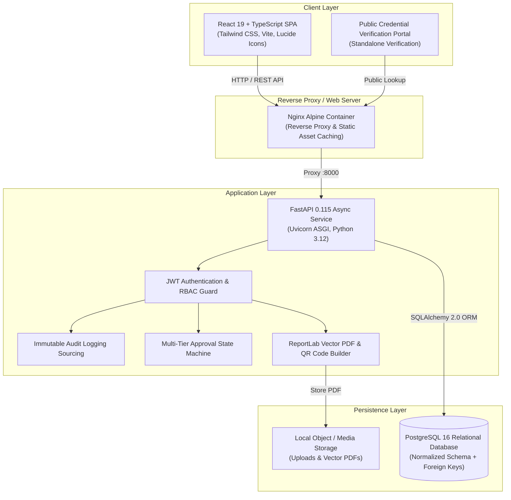

# Techno Club Management & Operations Platform (OS)

[](backend/tests/)
[](frontend/)
[](https://fastapi.tiangolo.com)
[](https://react.dev)
[](https://www.typescriptlang.org)
[](https://www.postgresql.org)
[](https://tailwindcss.com)

A complete, production-ready, extensible **internal operating system and ERP platform** engineered specifically for running a collegiate technology club.

> **Crucial Distinction:** This is **not a generic college marketing website or static portfolio**. It is a mission-critical **management platform and operating system** enabling club leadership, domain heads, faculty mentors, and student technologists to plan, govern, execute, budget, track, and document all club operations throughout the academic year.

---

## 🌟 Key Architectural Highlights

1. **No Supabase / Firebase / MongoDB Vendor Lock-in**:
   - Built on a normalized **PostgreSQL** schema managed via **SQLAlchemy 2.0** and **Alembic**.
   - Features zero-friction local developer fallback to SQLite for immediate plug-and-play testing without external service configuration.
2. **True Enterprise Role-Based Access Control (RBAC)**:
   - Dynamic role hierarchies: `President`, `Vice President`, `Domain Head`, `Member`, `Faculty Coordinator`, `Treasurer`, and `Technical Lead`.
   - 35+ granular permission nodes enforced at both API route decorators (`require_roles`, `check_permission`) and UI sidebar/button components.
3. **1-Click Demo Persona Switcher**:
   - Test any leadership or member perspective instantly from the top navigation bar or login screen without re-entering credentials.
4. **Dedicated Hackathon Engine**:
   - Full competition workflow: Multi-track problem statements, team formation codes, project submissions with GitHub/demo links, weighted multi-judge scoring criteria, and real-time live leaderboards.
5. **Cryptographic Certificate Generation & Verification Registry**:
   - Automated vector PDF certificate compilation with embedded cryptographic verification QR codes generated via **ReportLab** and **Pillow**.
   - Public standalone verification portal (`/verify-public`) allowing employers and university evaluators to authenticate credentials via serial ID or hash.
6. **QR Gate Attendance Check-in Scanner**:
   - Registration pass generator with unique QR tokens, camera-ready gate scanner simulator, and manual override rosters.
7. **Multi-Stage Approval State Machine**:
   - Automated routing: Proposer &rarr; Domain Review &rarr; VP Review &rarr; President Sanction &rarr; Budget Disbursal.
8. **NAAC / ABET Accreditation Export Hub**:
   - 1-click real-time normalized CSV data pipelines for Members, Events, Projects, Tasks, Disbursements, Sponsors, Attendance, and Audit Trails.

---

## 🏛️ System Architecture



---

## 👥 Role-Based Access Control (RBAC) Matrix

| Platform Module | President | Vice President | Domain Head | Member | Treasurer | Faculty Coordinator |
| :--- | :---: | :---: | :---: | :---: | :---: | :---: |
| **Executive Analytics & KPI Dashboard** | **Full** | **Full** | Domain View | Member View | Financial View | **Full** |
| **Member Management & Directory** | **Full** (CRUD) | **Full** (CRUD) | Domain Roster | Profile Only | View Only | View Only |
| **Domain Management (10 Technical Hubs)** | **Full** | **Full** | Lead Own Hub | View Hub | View Only | Oversight |
| **Events & Workshop Lifecycle** | Approve / CRUD | Review / CRUD | Propose / Lead | Register / Attend | Budget Link | Oversight |
| **Hackathon Engine & Judging** | Approve / Judge | Oversee | Judge Tracks | Form Team / Submit | Prize Disbursal | Oversight |
| **Engineering Projects & Milestones** | Inspect All | Inspect All | Manage Domain | Assigned Tasks | View Only | View |
| **Task Management Kanban** | Global Kanban | Global Kanban | Domain Kanban | Assigned Tasks | View | View |
| **Special Initiatives & Drives** | Approve / Create | Review / Create | Propose | Participate | Budget Link | Approve |
| **Approval Workflow State Machine** | **Final Sanction** | **Review Stage** | Submit / Domain | Propose | Budget Review | Compliance |
| **Attendance & QR Gate Check-in** | Scan / Manual | Scan / Manual | Domain Scan | My Passes | View Turnout | View |
| **Certificates Registry & PDF Generator** | Issue / Revoke | Issue | Issue Track | My Certificates | View | Verify |
| **Meetings, Agendas & Decisions** | Schedule / MoM | Schedule / MoM | Domain Meet | Attend | View | Attend |
| **Hardware & Digital Licenses Inventory** | Full Custody | Full Custody | Request Kit | Assigned Kit | Asset Audit | View |
| **Treasury, Budgets & Reimbursements** | Sanction Cap | Review Claims | Domain Request | Submit Expense | **Disburse / Reject** | Audit |
| **Corporate Sponsorship & MOU CRM** | Sign MOU | Negotiate | Request Sponsor | View Partners | Invoicing | Legal Review |
| **Document Vault & Proposals** | Full | Full | Domain Docs | Public Docs | Financial Docs | Institutional |
| **Unified Club Calendar & Timeline** | Full Schedule | Full Schedule | Domain Filter | Personal Agenda | Full Schedule | Full Schedule |
| **Accreditation CSV Data Export Hub** | Instant All | Instant All | Domain CSV | My Data | Financial CSV | Accreditation |
| **Immutable System Audit Trail** | **Full Trail** | **Full Trail** | — | — | Ledger Trail | **Full Trail** |

---

## 📦 The 18 Operational Modules

### 1. Executive Dashboard
- High-level command center with real-time KPI stat cards: Active Membership, Projects in Flight, Event Roster, Task Velocity, Treasury Utilization, and external sponsorship raised.
- Approval queues, domain workload distribution charts, and upcoming deadlines alert feed.
- Dynamic persona-aware rendering: Automatically transforms between **Executive Leadership View** and **Member Personal Workspace**.

### 2. Member Management System
- Comprehensive roster tracking College ID, department, year/semester, assigned technical domain, skills matrix, and lifecycle status (`Active`, `Inactive`, `Alumni`, `Suspended`).
- Profile detail views linking all events participated in, assigned projects, active tasks, and verified credentials.

### 3. Domain Management (10 Specialized Technical Hubs)
- Native support for:
  - 🤖 **AI/ML**
  - 🌐 **Web Development**
  - 📱 **App Development**
  - 🛡️ **Cyber Security**
  - ☁️ **Cloud & DevOps**
  - ⚡ **IoT & Robotics**
  - 🏆 **Competitive Programming**
  - 🎨 **UI/UX & Design**
  - ⛓️ **Blockchain**
  - 🔬 **Research & Innovation**
- Domain dashboards with member rosters, active projects, task completion rates, and lead engineer assignments.

### 4. Event Lifecycle Management
- Supports Workshops, Seminars, Tech Talks, Coding Contests, Ideathons, Project Expos, and Technical Fests.
- Complete state machine: `Draft` &rarr; `Proposal` &rarr; `Approval Pending` &rarr; `Approved` &rarr; `Registration Open` &rarr; `Registration Closed` &rarr; `Ongoing` &rarr; `Completed` &rarr; `Report Submitted` &rarr; `Archived`.
- Speaker profiles, judge assignments, budget tracking, and real-time registration quotas.

### 5. Dedicated Hackathon Engine
- Dedicated competition module equipped with:
  - Multi-track problem statements and challenge guidelines.
  - Team creation with unique join invite codes and leader assignments.
  - Project submission portal capturing GitHub repositories, live demo URLs, video pitch links, and slide decks.
  - Multi-judge evaluation scoring matrix with weighted criteria.
  - Real-time live leaderboard with automated rank calculations.

### 6. Engineering Projects & Milestones
- Cross-domain and club-wide engineering projects with target delivery dates, lead developers, milestone checklists, and direct repository integrations.

### 7. Task Management Kanban Board
- Professional project management board featuring:
  - Interactive columns: `Todo`, `In Progress`, `Review`, `Completed`, `Blocked`.
  - Priority levels: `Low`, `Medium`, `High`, `Urgent`.
  - Subtask checklists with progress bars, task dependencies, estimated vs actual hours, and threaded discussions.

### 8. Special Initiatives & Activities
- Dedicated tracker for campus recruitment drives, freshmen orientation bootcamps, tech awareness campaigns, and research delegations.

### 9. Multi-Tier Approval Workflow
- Formal governance pipeline:
  ```
  Initiator Proposal -> Domain Head Endorsement -> VP Operational Review -> President Sanction -> Execution
  ```
- Complete approval history timeline with reviewer comments, revision requests, and automatic state synchronization with events/projects.

### 10. Attendance Management & QR Scanner
- Digital event pass generator with unique cryptographic QR tokens.
- Live camera check-in simulator and manual check-in roster.
- Turnout rate metrics for college administration reporting.

### 11. Cryptographic Certificate Registry & PDF Generator
- Built-in **ReportLab** vector PDF engine that formats, styles, and compiles certificates on-the-fly.
- Embedded high-density verification QR codes pointing to the public verification registry.
- 1-click PDF download and public verification portal (`VerifyCertificatePage`).

### 12. Meeting Management & Decisions Recorder
- Calendar scheduler for executive meetings, domain syncs, and emergency councils.
- Formally records Minutes of Meeting (MoM), ratified decisions, action items, assignees, and due dates.

### 13. Hardware & Digital Assets Management
- Physical inventory tracker for microcontrollers (Raspberry Pi, Arduino), sensor modules, drones, lab equipment, and laptops.
- Digital asset tracker for cloud accounts (AWS/GCP), API keys, and developer IDE licenses.
- Check-out and custody assignment with return due dates.

### 14. Treasury, Budgets & Reimbursements
- Fiscal year budget allocation per event and domain.
- Member expense claim logging with receipt attachments and multi-stage status (`Pending`, `Approved`, `Reimbursed`, `Rejected`).

### 15. Corporate Sponsorship CRM & Pipeline
- Partner pipeline stages: `Prospect` &rarr; `Contacted` &rarr; `Proposal Sent` &rarr; `Negotiation` &rarr; `Confirmed` &rarr; `Completed`.
- Sponsorship tiers: Title, Platinum, Gold, Silver, Community.
- Tracks MOU legal execution, brand deliverables, and invoice payment statuses.

### 16. Document Vault & File Management
- Centralized knowledge base for permission letters, event proposals, financial balance sheets, and post-event retrospectives.
- Configurable public vs internal privacy controls.

### 17. Unified Club Calendar & Timeline
- Combined monthly grid and agenda schedule aggregating workshops, hackathon milestones, project delivery dates, and task deadlines.

### 18. Accreditation & Data Analytics Hub (CSV)
- Instant, 1-click export of 8 normalized datasets (`members`, `events`, `projects`, `tasks`, `expenses`, `sponsors`, `attendance`, `audit`) formatted for ABET / NAAC accreditation.
- Comprehensive system audit log with JSON diff payloads.

---

## 🚀 Quick Start Guide

### Option A: 1-Click Automated Launch (Recommended)

You can launch the entire stack (FastAPI Backend + React Vite Frontend + Seed Database + Browser) with a single command:

**Option 1: Windows Batch (Command Prompt or Double-Click):**
```cmd
start.bat
```
*(or `start_platform.bat`)*

**Option 2: PowerShell:**
```powershell
.\start.ps1
```
*(or `.\start_platform.ps1`)*

**Option 3: Unified Python Launcher (Cross-Platform Windows/macOS/Linux):**
```bash
python start.py
```

This automatically:
1. Verifies virtual environments and installs missing packages (`pip`, `npm`).
2. Initializes the database schema and default seed data.
3. Launches the FastAPI backend service on `http://localhost:8000`.
4. Launches the React Vite frontend portal on `http://localhost:5173`.
5. Waits for health checks and automatically opens `http://localhost:5173` in your default browser.
6. Pressing `Ctrl+C` in `start.py` cleanly terminates both frontend and backend processes.

---

### Option B: Manual Step-by-Step Setup

#### 1. Backend Setup
```bash
cd backend

# Create and activate virtual environment
python -m venv .venv
# On Windows PowerShell:
.\.venv\Scripts\Activate.ps1
# On macOS/Linux:
source .venv/bin/activate

# Install dependencies
pip install -r requirements.txt

# Initialize database schema & seed all domains, leadership, events, and hackathons
python -m app.db.init_db

# Start backend server
uvicorn app.main:app --host 0.0.0.0 --port 8000 --reload
```
- Interactive Swagger API Documentation: `http://localhost:8000/docs`
- ReDoc API Documentation: `http://localhost:8000/redoc`

#### 2. Frontend Setup
```bash
cd frontend

# Install packages
npm install

# Start Vite development server
npm run dev
```
- Open `http://localhost:5173` in your browser.

---

### Option C: Production Docker Compose Deployment

To self-host the entire platform with PostgreSQL, FastAPI, and Nginx:
```bash
docker-compose up --build -d
```
Services will launch as follows:
- **Operations Frontend:** `http://localhost:3000`
- **FastAPI REST API:** `http://localhost:8000`
- **PostgreSQL Database:** `localhost:5432`

---

## 🔑 Default Seed Credentials & Personas

All accounts are pre-seeded with the universal password: `TechnoClub@2026`

| Persona / Officer | Email Address | Assigned Role | Capabilities Highlight |
| :--- | :--- | :--- | :--- |
| **President** | `president@technoclub.org` | President | Full club-level sanctions, approvals, finances, and audit logs |
| **Vice President** | `vp@technoclub.org` | Vice President | Operational oversight, event management, and proposal reviews |
| **AI/ML Domain Head** | `aiml.head@technoclub.org` | Domain Head | AI/ML domain projects, member tasks, and hackathon judging |
| **Web Dev Domain Head** | `web.head@technoclub.org` | Domain Head | Full-stack projects, domain tasks, and technical workshops |
| **Cyber Security Head** | `cyber.head@technoclub.org` | Domain Head | CTF competitions, security workshops, and tool licenses |
| **Treasurer** | `treasurer@technoclub.org` | Treasurer | Sanctioned budget allocations and expense reimbursement claims |
| **Faculty Coordinator**| `faculty@technoclub.org` | Faculty Coordinator | Institutional oversight, compliance reviews, and permission approvals |
| **Club Member** | `member1@technoclub.org` | Member | Focused personal dashboard, task board, and digital passes |

> **Pro-Tip:** Use the **1-Click Persona Switcher** dropdown in the top navigation bar to switch between roles on the fly without logging out!

---

## 🧪 Testing

The platform includes an automated pytest suite verifying authentication, RBAC, domain routing, event registration, hackathon team formation, multi-stage approvals, certificate cryptographic verification, CSV exports, and global search.

Run the test suite:
```bash
cd backend
.\.venv\Scripts\python -m pytest tests/ -v
```
All **10/10 tests pass cleanly**.

To verify the frontend TypeScript compilation and bundle:
```bash
cd frontend
npm run build
```
Bundle builds cleanly with **zero TypeScript errors**.

---

## 📄 License & Integrity
Crafted for college engineering clubs and technical student societies. Open-source, production-ready, and extensible.
